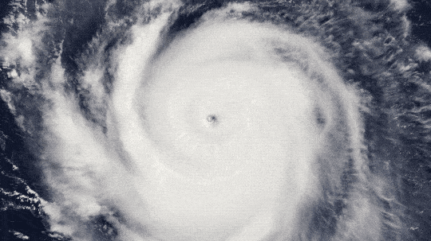

# Hurricane Visualization Project with R

## Overview

Welcome to my hurricane visualization project repository! In this project, I utilized R to visualize hurricane data, aiming to provide insights into various attributes and patterns of hurricanes.

## Data

The data can be accessed by installing the tidyverse package and accessing the storms data set.

## Features

- **Frequency Analysis**: Utilized statistical methods to identify frequency types for different hurricane classifications, revealing insights into the distribution of storm types over time.
- **Latitude Comparison**: Created visualizations to compare the differences in latitude among various hurricanes, shedding light on geographical patterns and preferences for hurricane formation.
- **Longitude Variation**: Conducted analysis on the differences in longitude among different storm classifications, uncovering potential correlations between storm trajectories and geographical regions.
- **Wind Speed and Pressure Analysis**: Employed statistical techniques to analyze variations in wind speeds and pressures associated with different hurricane types, providing insights into storm intensity and characteristics.
- **Comprehensive Comparison**: Generated comprehensive visualizations to compare wind speeds, pressures, and other attributes across all hurricanes in the dataset, enabling a holistic understanding of hurricane behavior and patterns.

## Usage

To explore the visualizations and insights:

1. Clone this repository to your local machine.
2. Open the project in RStudio or any preferred R environment.
3. Run the provided scripts to generate visualizations and explore the data.
4. Gain insights into hurricane behavior and patterns from the generated visualizations.

## Dependencies

Ensure you have the following dependencies installed:

- R
- tidyverse

## Contributions

Contributions and feedback are highly appreciated! Thank you for your interest in this project!

